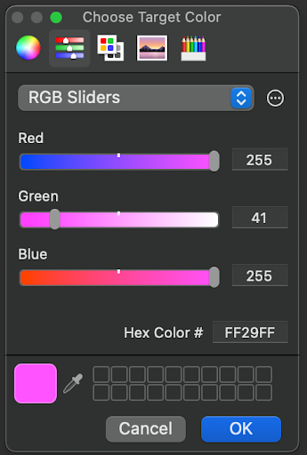
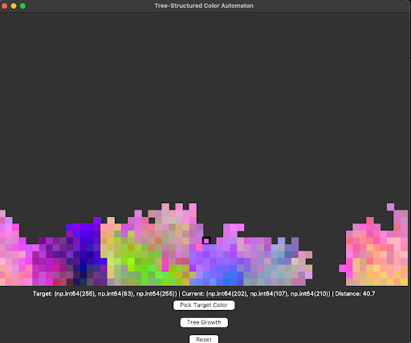
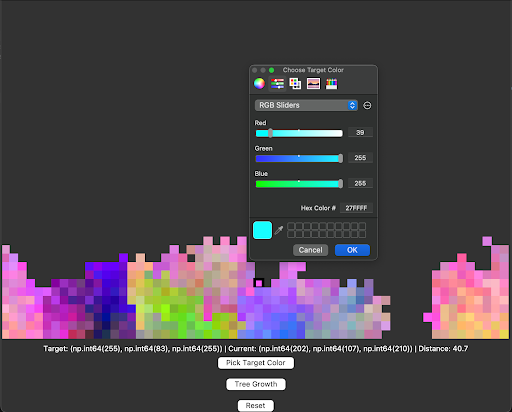
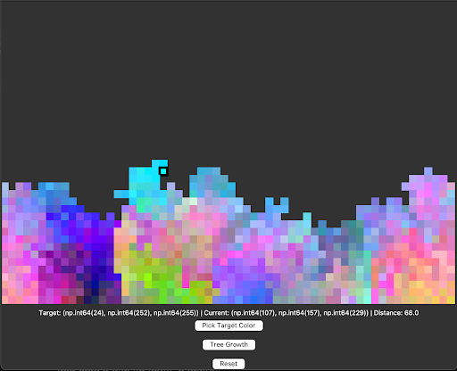
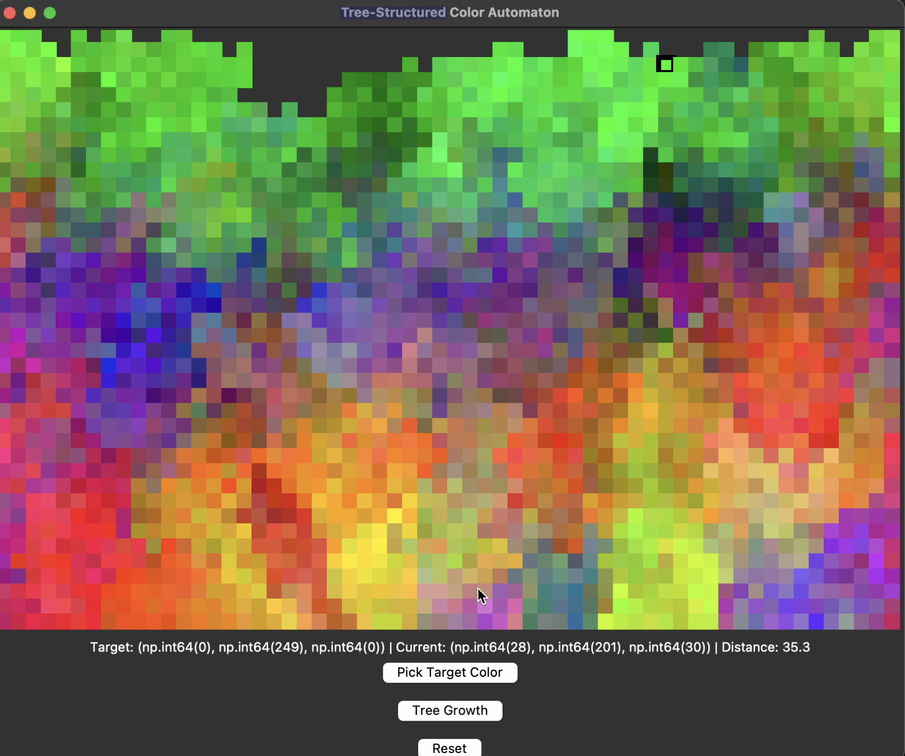

# Cellular Automata with Color Blending

This is a bonus project for ASU CSE 355 with Professor Amor. For this project, I wanted to transform traditional CA models that usually have binary states (e.g. dead/alive) and add my own creative twist via color blending and random branching patterns.

## Project Concept

Traditional CA models typically use binary states (dead/alive). This implementation adds:
- **Color blending** for smooth visual transitions
- **Probabilistic branching** for organic growth patterns
- **Gaussian distribution** and controlled randomness for natural variation

## Inspiration

The project draws from three key concepts:

1. **Dynamic growth patterns**  
   Simulating how trees branch from a single cell outward

2. **Color diffusion**  
   Gradual blending between base and target colors

3. **Probabilistic rules**  
   Moving beyond deterministic and standard [Cellular Automata rules](https://plato.stanford.edu/entries/cellular-automata/supplement.html) to incorporate dynamic branching

## Features

- Interactive GUI for target color selection
- Custom growth algorithms with:
  - Color blending (`blend_factor = 0.8 + random.random() * 0.2`)
  - Gaussian noise mutation (`±15` for variation)
  - 30% branching probability
- Visual feedback of growth progression
- Automatic termination when reaching target color or top boundary

## Example Output
## Simulation Workflow

### 1. Choose Target Color
Select your desired color via the interactive color picker  


### 2. Growth Process
The automaton grows while blending colors until either:
- Reaches target color (within RGB distance of 5)
- Hits the top grid boundary



### 3. Generated Artworks
Example outputs from different runs:
<div align="center">
  
  
</div>

### 4. Demo
[](https://youtu.be/nXKzTjxYafY)

## Requirements

- Python
- NumPy
- tkinter

## Usage

```bash
python cellular_automata.py
